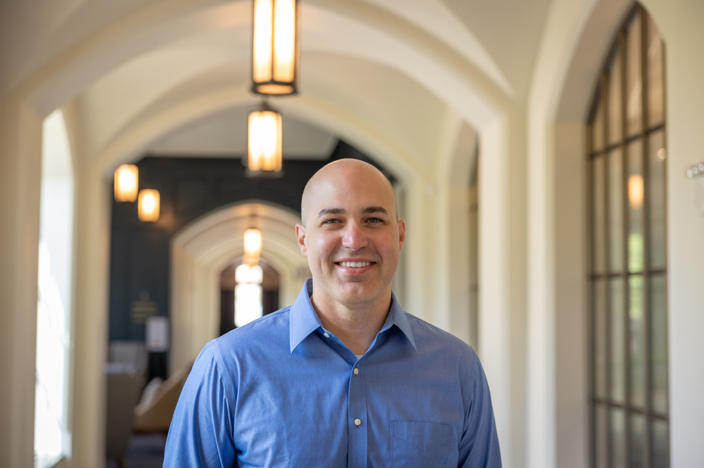

Welcome to my portfolio page! My name is Steve and I am a data science student at Notre Dame (Class of 2026). This site is intended to showcase my data science skills and interests.

[Email Me!](mailto:steven.villalon@gmail.com) 

# Projects

## [1. Histograms & Hoops](http://histogramsandhoops.streamlit.app)

During the Fall 2024 semester, I took courses in Probability & Statistics and Python programming. I wanted to come up with a project that would help me apply the concepts I was learning in both classes. In Statistics, we covered topics like histograms, probability distributions, and random variables. One day, while watching a basketball game with friends, I realized that the abundance of available basketball data would be a great resource to apply these techniques.

This app, built with Python and Streamlit, uses data from the NBA API, and focuses on box scores for all players in the 2023-2024 NBA season. It allows users to explore histograms of various player statistics and also estimate the probability of a player reaching a specific performance threshold, like scoring 30 points in a game. In a future version, I plan to expand the app by adding more variables and using regression models to improve prediction accuracy.

## 2. Coming Soon...

Next semester, I'll be diving into Linear Models and Introduction to Machine Learning, so a new project is on the horizon. Stay tuned!

 
### About Me

I'm a marketing professional with 9 years of experience working for AT&T. Marketing and data science are intricately connected, which is why I am currently pursuing a Master's degree in Data Science. I love helping executives answer questions about what's going on with their business.

I live in Miami, FL with my wife Alejandra and my dog Albert.

 

**Last Updated:** November 13, 2024